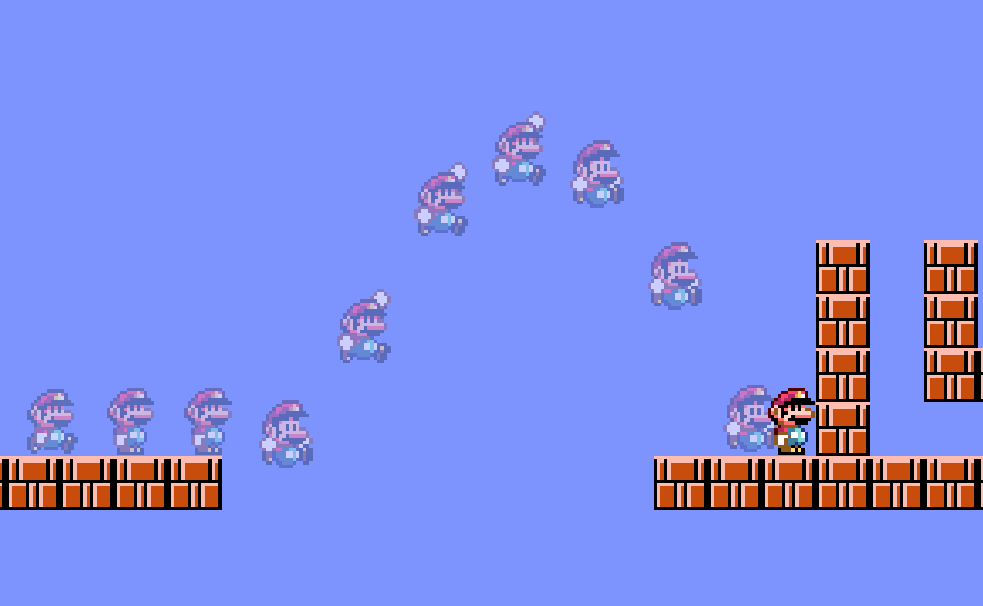

# TestInput
# Implement of GDC：Forgiveness Mechanics: Reading Minds for Responsive Gameplay 
  
Unity Demo  
# Implemented mechanics：  
1.Coyote Jump  
2.Jump Input Buffer  
3.Pass one-grid holes  
4.One-grid jump aligning   
5.Hitbox Pinching  
